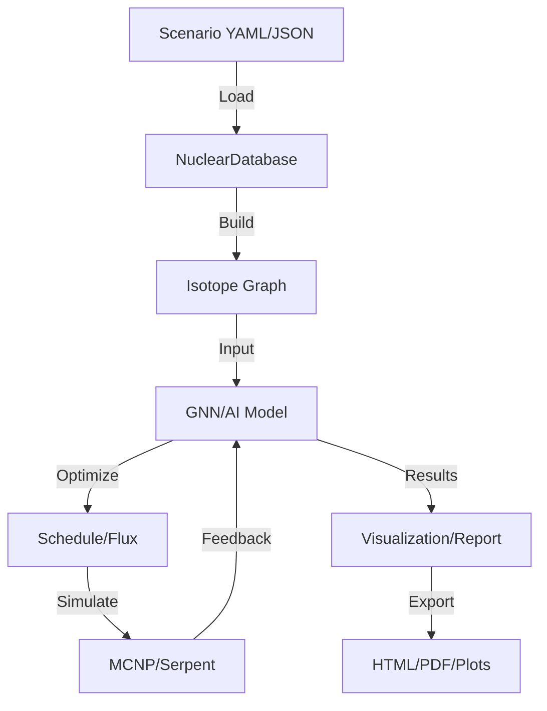

# ♻️ NuclearAI: AI-Guided Nuclear Waste Transmutation Network 🚀


## 🌟 Overview

**NuclearAI** transforms nuclear waste management into an AI-powered optimization challenge. Using Graph Neural Networks (GNNs), advanced optimization, and Monte Carlo code integration, it models isotopic transmutation under neutron irradiation to minimize radiotoxicity and heat load. The system is modular, research-grade, and ready for real-world deployment or academic research.

---

## ✨ Features
- **Graph Neural Networks** for isotope transmutation networks
- **Full decay/activation chain modeling**
- **Multi-objective & genetic optimization** (radiotoxicity, decay heat, neutron economy)
- **Reinforcement Learning & Bayesian Optimization** for schedule tuning
- **Batch scenario runner** for large-scale experiments
- **MCNP/Serpent integration** (Monte Carlo feedback loop)
- **2D, 3D, and interactive network visualizations**
- **Streamlit web dashboard** for interactive exploration
- **Auto-report generation** (HTML/PDF with plots, tables, executive summary)
- **Comprehensive CLI** with subcommands for all workflows
- **Unit tests, scenario templates, and extensible architecture**

---

## 🛠️ Installation

```bash
# Clone the repo
$ git clone https://github.com/yourusername/nuclearai.git
$ cd nuclearai

# Install dependencies (consider using a virtualenv)
$ pip install -r requirements.txt

# (Optional) For Bayesian optimization and reporting:
$ pip install scikit-optimize jinja2 pandas

# (Optional) For MCNP/Serpent integration, ensure those codes are installed and in your PATH
```

---

## 🚦 Quickstart

### 1. Run a Single Scenario
```bash
python -m nuclearai.cli run --scenario nuclearai/scenario_templates/example_scenario.yaml --plot
```

### 2. Batch Experiments
```bash
python -m nuclearai.cli batch --scenario-dir nuclearai/scenario_templates --output-dir batch_results
```

### 3. Generate an Auto-Report
```bash
python -m nuclearai.cli report --results-dir batch_results --output-file auto_report.html
```

### 4. Launch the Web Dashboard
```bash
streamlit run nuclearai/web_dashboard.py
```

### 5. Run Unit Tests
```bash
python -m unittest discover nuclearai/tests
```

---

## 🧬 Advanced Examples

- **Reinforcement Learning**: `python -m nuclearai.cli rl --scenario ...`
- **Bayesian Optimization**: `python -m nuclearai.cli bayes --scenario ...`
- **3D Network Visualization**: Use `visualization.plot_3d_network(G)` in your scripts.
- **Custom Scenarios**: Edit or add YAML/JSON files in `nuclearai/scenario_templates/`.
- **Auto-Report**: Generates HTML with plots, tables, and executive summary for stakeholders.

---

## 🏗️ Architecture



---

## 📚 Documentation
- See `nuclearai/docs.md` for full API reference and advanced usage.
- Example scripts: `nuclearai/examples.py`
- Scenario templates: `nuclearai/scenario_templates/`

---

## 🤝 Contributing
Pull requests, issues, and feature suggestions are welcome! Please see `CONTRIBUTING.md` for guidelines.

---

## 📜 Citation
If you use NuclearAI in your research, please cite:

```
@software{nuclearai,
  author = {Amir Hossein Rasti},
  title = {NuclearAI: AI-Guided Nuclear Waste Transmutation Network},
  year = {2024},
  url = {https://github.com/yourusername/nuclearai}
}
```

---

## 🧠 Acknowledgements
- PyTorch Geometric
- NetworkX
- MCNP, Serpent
- Streamlit, Plotly, Matplotlib
- scikit-optimize, Jinja2, Pandas

---

## 💡 License
MIT License. See `LICENSE` for details. 